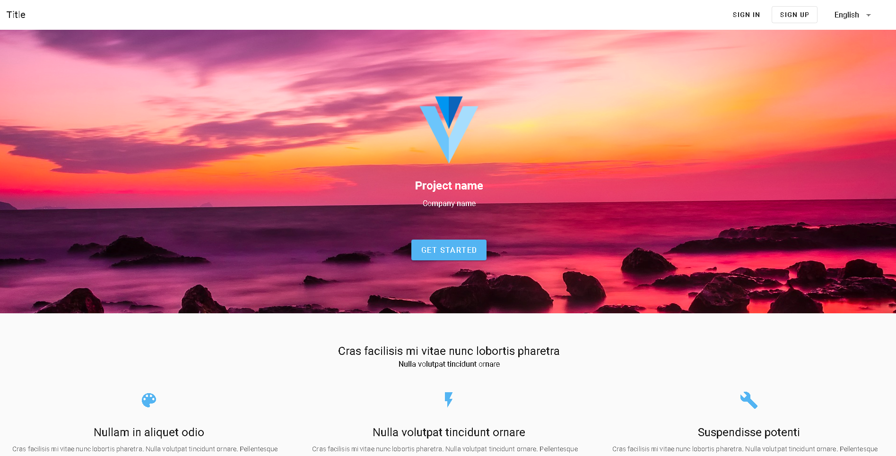
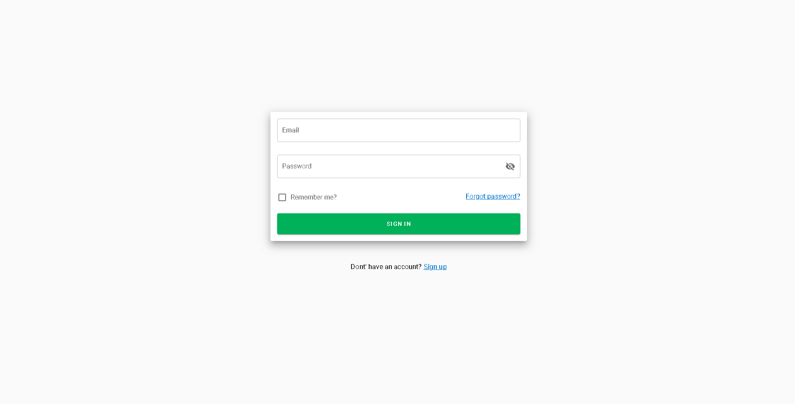
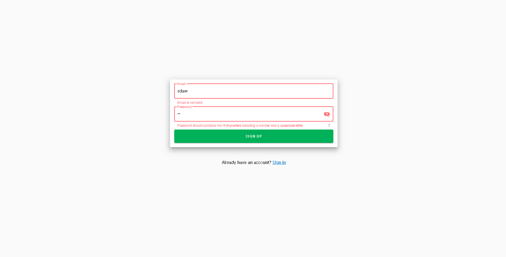
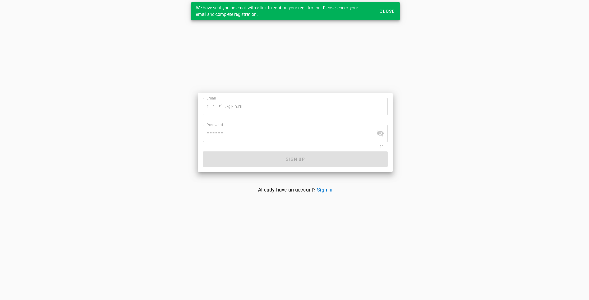
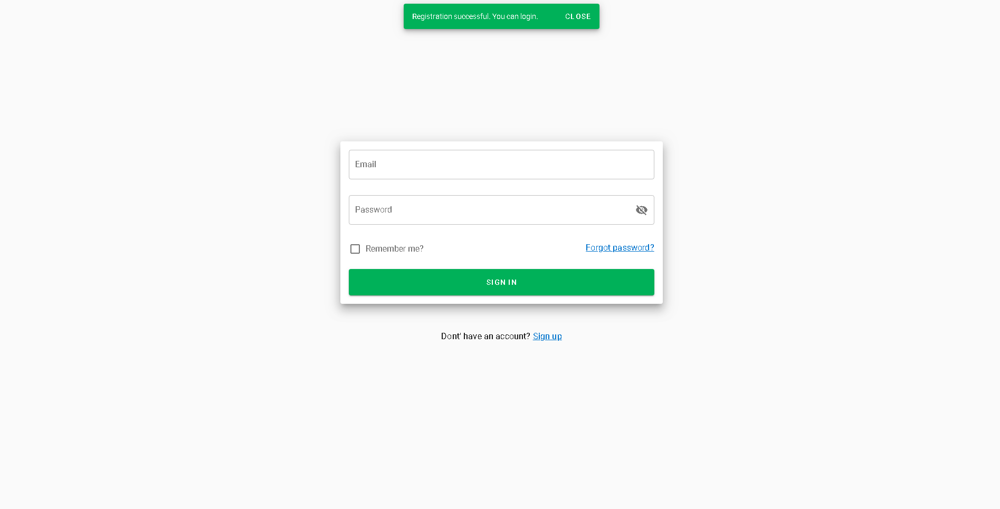
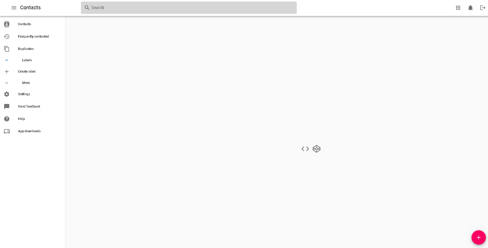
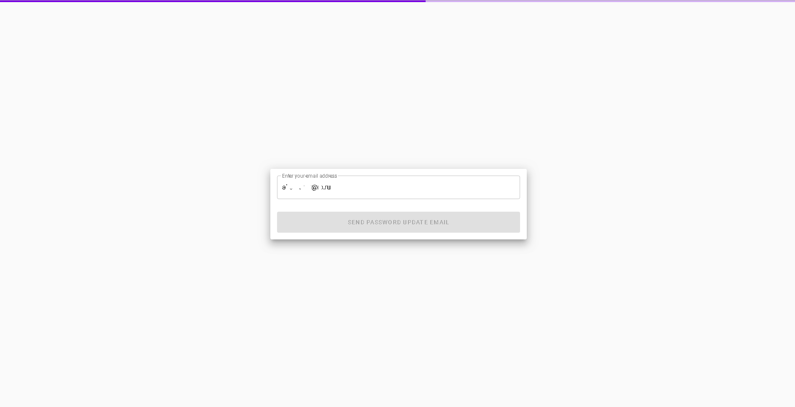

## First App run
### Inside the root directory do a:
```
mvn clean install
```

### Inside the root directory do a:
```
mvn --projects backend spring-boot:run
```
## Faster feedback with webpack-dev-server
The webpack-dev-server, which will update and build every change through all the parts of the JavaScript build-chain, is pre-configured in Vue.js out-of-the-box! So the only thing needed to get fast feedback development-cycle is to cd into frontend and run:
```
npm run serve
```
##

Start page



Sign in



Sign up



Registration in progress



Registration success



Protected page



Password update




